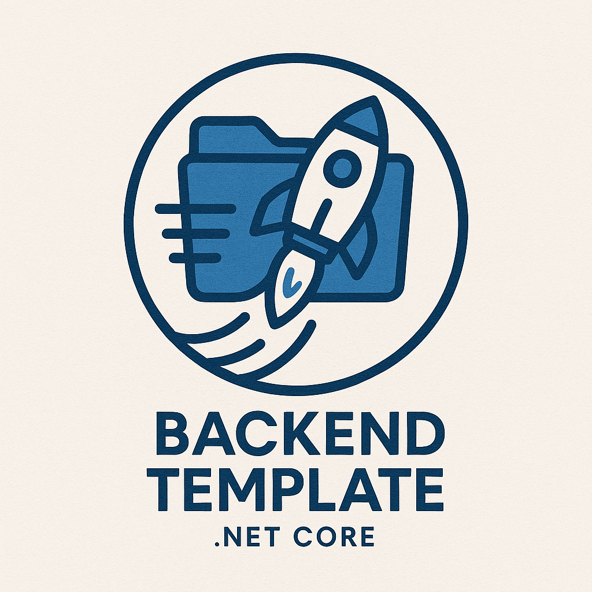

## 📄 Descripción

CoreDriven es un proyecto desarrollado en C# cuyo objetivo es proporcionar una base sólida y escalable para aplicaciones empresariales, siguiendo las mejores prácticas de arquitectura y desarrollo de software. Este repositorio está diseñado para facilitar la creación, mantenimiento y escalabilidad de proyectos .NET.

## 📖 Publicaciones.
Puedes encontrar algunos articulos relacionados a este template [aqui](https://dev.to/betoramiz/coredriven-un-template-de-arquitectura-limpia-en-net-para-acelerar-tu-desarrollo-3691)

## ✨ Características

- 🧩 Arquitectura limpia y modular basada en principios SOLID.
- 🏗️ Separación de capas para mejorar el mantenimiento y la escalabilidad.
- ⚡ Integración sencilla de nuevas funcionalidades.
- 🧪 Listo para pruebas unitarias y de integración.

## 📁 Estructura del Proyecto

``` 
CoreDriven/
├── 🧠 Core/           # Lógica de negocio y entidades principales
├── 🏢 Infrastructure/ # Implementación de servicios y acceso a datos
├── 📦 Application/    # Casos de uso, DTOs, y lógica de aplicación
├── 🌐 API/            # Endpoints y presentación (si aplica)
└── 🧪 Tests/          # Pruebas unitarias y de integración
```

## ⚙️ Requisitos

- [🟣 .NET SDK](https://dotnet.microsoft.com/download) 8.0 o superior

## 🚦 Instalación y Uso

1. 📥 Clona el repositorio:
    ```bash
    git clone https://github.com/betoramiz/coredriven.git
    ```

2. 📂 Accede al directorio del proyecto:
    ```bash
    cd coredriven
    ```

3. 🛠️ Restaura los paquetes y compila la solución:
    ```bash
    dotnet restore
    dotnet build
    ```

4. ▶️ Ejecuta el proyecto:
    ```bash
    dotnet run --project API
    ```

---

Desarrollado por [betoramiz](https://github.com/betoramiz)
